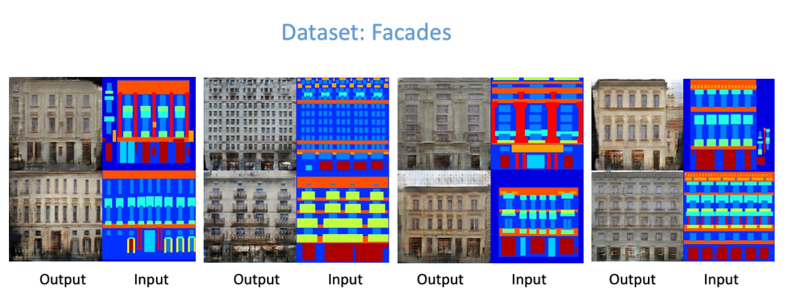

#  Pix2pix_tensorflowCode 

Copyright@ Yiru Chen

Implement [Image-to-Image Translation with Conditional Adversarial Networks](https://arxiv.org/abs/1611.07004?context=cs) on tensorflow.

## Setup

### Prerequisites
- Python with numpy
- NVIDIA GPU + CUDA 8.0 + CuDNNv5.1
- TensorFlow 0.12

### Getting Started
- Download the dataset (script borrowed from [torch code](https://github.com/phillipi/pix2pix/blob/master/datasets/download_dataset.sh)):
```bash
bash ./download_dataset.sh facades
```
- Train the model
```bash
bash python train.py
```
## Train
Current code supports [CMP Facades](http://cmp.felk.cvut.cz/~tylecr1/facade/) dataset. And the latest implementation trains for 200 epochs.
You are free to modify the constants in config.py.

## Results
Here shows some of the pictures generated from this implementation.

- Datasets: Facades
<div align=center>



</div>

## Acknowledgments

My implementation referenced [pix2pix](https://github.com/phillipi/pix2pix). Thanks for their excellent work!


## License

Copyright (c) Yiru Chen

Licensed under the Apache License.

